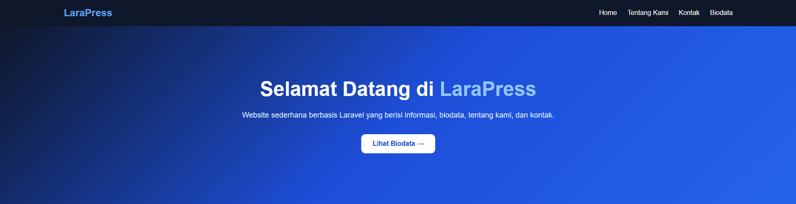
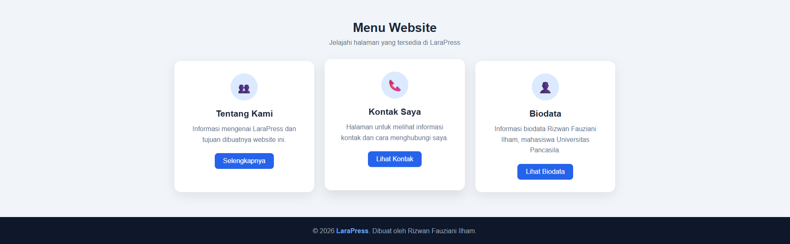
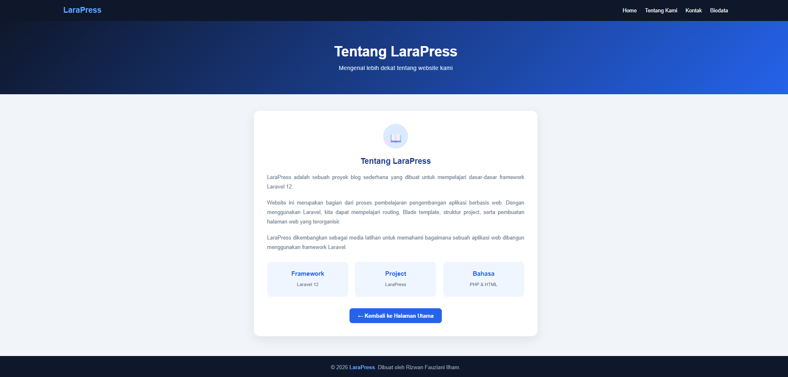
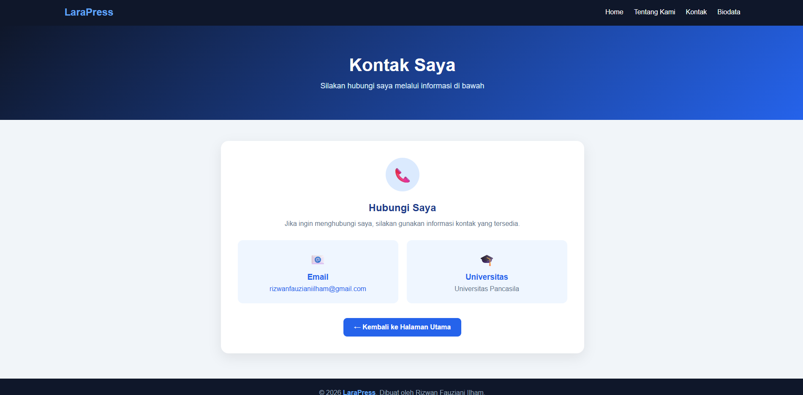
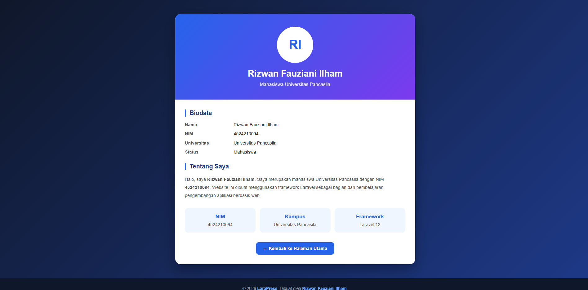

# LaraPress

LaraPress adalah project website sederhana berbasis **Laravel 12** yang dibuat sebagai media pembelajaran framework Laravel dan pengembangan aplikasi web.

Website ini memiliki beberapa halaman utama seperti Home, Tentang Kami, Kontak, dan Biodata.

---

## 👨‍🎓 Identitas Pembuat

| Keterangan | Informasi |
|---|---|
| Nama | Rizwan Fauziani Ilham |
| NIM | 4524210094 |
| Universitas | Universitas Pancasila |
| Project | LaraPress |
| Framework | Laravel 12 |

---

## 📌 Tentang Project

Project ini bertujuan untuk mempelajari dasar-dasar pengembangan aplikasi web menggunakan Laravel, khususnya:

- Routing Laravel
- Blade Template
- Struktur folder Laravel
- Pembuatan halaman web
- Penggunaan CSS
- Navigasi antar halaman
- Pembuatan tampilan responsive
- Menjalankan aplikasi menggunakan Laravel Artisan

---

## ✨ Fitur Website

Website LaraPress memiliki beberapa halaman:

### 🏠 Halaman Utama

Halaman utama website yang berisi:

- Welcome section
- Navigasi website
- Tentang Kami
- Kontak Saya
- Biodata

## 🖼️ Tampilan Website

Berikut adalah tampilan dari setiap menu yang tersedia pada website LaraPress.

### 🏠 1. Halaman Utama

Halaman utama menampilkan menu navigasi dan beberapa pilihan halaman yang tersedia.

---

### 📖 2. Halaman Tentang Kami

Halaman ini berisi informasi mengenai project LaraPress dan tujuan pembuatannya.

---

### 📞 3. Halaman Kontak Saya

Halaman kontak berisi informasi untuk menghubungi pembuat website.

---

### 👤 4. Halaman Biodata

Halaman biodata berisi informasi mengenai Rizwan Fauziani Ilham.

